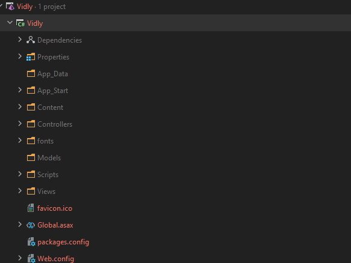
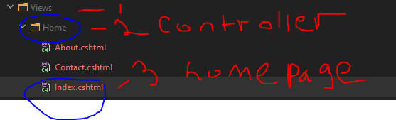
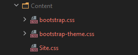
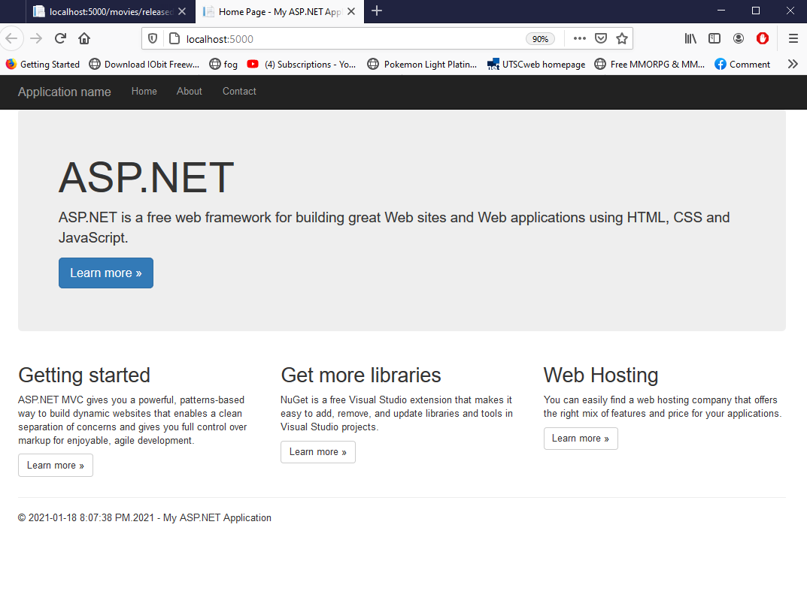

# MVC BASIC

  # What is MVC?
***
**MVC stands for model view controller**
### Model
- has data and behavior
- usually think of it a class or bunch of interface things.
- in a video rental app it will have movie rental customer and transaction
    - video movie customer transaction all are class
    - has method and properties
    - think of it as a console simple console app with class and interface nothing else
    - plain objects
***
### VIew
- just plain html but with c# specified
***
### Controller
- handles html request
- controller handles request say when I click on ebgames/ps4 webiste
 -  it will be based on three tier
 - View<--controller-->model
 - controller plays a central role
 - controller will get all the info model class which is a ps4 game
 - then the view will show it presentable form
---
### router
- select the right controller
- ebgames.ca/ps4 --> [router]-->[ps4Controlelr from controller]
  - this means when ever ps4controller will act as a parent for ps4 class to get database info.

 ---
 ## FOLDER STRCUTRE IN MVC
 
 ## APPDATA FOLDER
  - holds data like text file
  - also holds data base as well
  ---
## APP_START FOLDER
   
   - start when application starts
   - RouteConfig.cs
    ```

    namespace Vidly
    {
        public class RouteConfig
        {
            public static void RegisterRoutes(RouteCollection routes)
            {
                routes.IgnoreRoute("{resource}.axd/{*pathInfo}");

                routes.MapRoute(
                    name: "Default",
                    url: "{controller}/{action}/{id}",
                    defaults: new {controller = "Home", action = "Index", id = UrlParameter.Optional}
                );
            }
        }
    }
    this is the code inside  RouteConfig.cs
    #defaults: new {controller = "Home", action = "Index", id = UrlParameter.Optional}
     # this the default when nothing else is given
        # thus in this case go to HOME INSIDE VIEW FOLDER then GO TO INDEXfile
        #id is optional as not everything needs a id
    ```
  ## Visual guide
  

 ---
 ## Content Folder
 -  usually have Client side things like picture
 -  also has styles or css
 -   


---
## Controller Folder
-  handle user request usually
-   
   - currently only has one controller this is responsible for homepage inside views folder

### result equals  

 # +   
 

=    

---
## VIEW Folder
-  handles controllers 

-    
