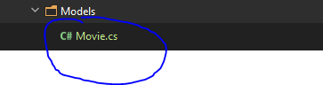
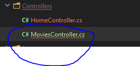
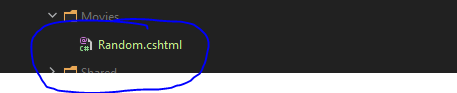
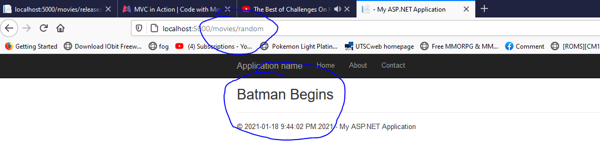

### MVC IN ACTION
---
1. Create class in Models folder
  - 

  ```
  namespace Vidly.Models
  {
      public class Movie
      {
          public int Id { get; set; }
          public string Name { get; set; }
      }
      // this is a basic class when
  }
  ```
- this is a plain old class
- does not have any behaviour or state
2. Create a Controller in Controller folder
  - controller is responsible for dealing with movie class
  - it will present the project in html form
  -  

```
using System.Web.Mvc;
using Vidly.Models;

namespace Vidly.Controllers
{
    public class MoviesController : Controller
    {
        // GET
        public ActionResult Random()
        {
            var movie = new Movie(){Name="Batman Begins"}; // created an object
            return View(movie); // a object of movie is passed to View this will be returned on soon to be create View folder.
        }
    }
}

```
3. Create View for the MoviesController
   - the View folder with name **Movies** will be created
  - if it was MovieController the folder name would be **Movie** instead of **Movies**  
  - 
      - inside there is a file name **Random.cshtml**
      - this created due to Action result function name inside MoviesController class
      ```
      using System.Web.Mvc;
      using Vidly.Models;

      namespace Vidly.Controllers
      {
          public class MoviesController : Controller
          {
              // GET
              public ActionResult Random()
              {
                  var movie = new Movie(){Name="Batman Begins"}; // created an object
                  return View(movie); // a object of movie is passed to View this will be returned on soon to be create View folder.
              }
          }
      }
      ```
      in here clearly there is a Action resulltName Random()
      thus to use the page it will be like this movies/random and what ever the result show 

  4. setting up View
      ```
     @model Vidly.Models.Movie 
     <!-- This is required as the model is refering the movie object from MoviesController -->
     
     @{
        
         Layout = "~/Views/Shared/_Layout.cshtml"; // this is for cs template 
     }
     
     <h2>@Model.Name</h2>
 // this will show the name 
     ```    

- in the search bar it clearly shows movies/random 
- also shows the movie title which was created on MoviesController 

```
using System.Web.Mvc;
using Vidly.Models;

namespace Vidly.Controllers
{
    public class MoviesController : Controller
    {
        // GET
        public ActionResult Random()
        {
            var movie = new Movie(){Name="Batman Begins"}; // created an object
            return View(movie); // a object of movie is passed to View this will be returned on soon to be create View folder.
        }
    }
}
```
 BATMAN BEGINS showed up the webpage 
