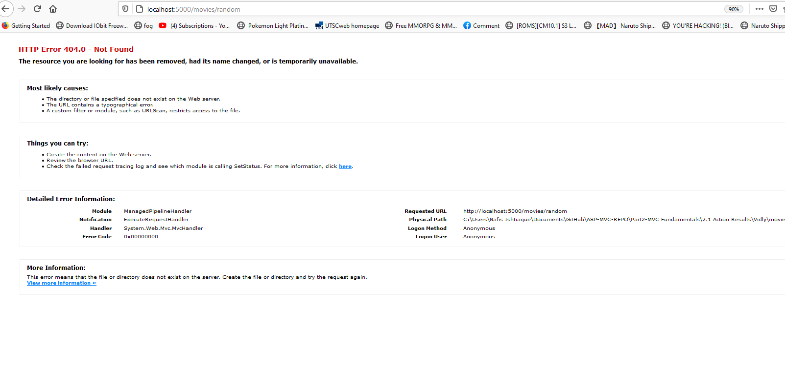
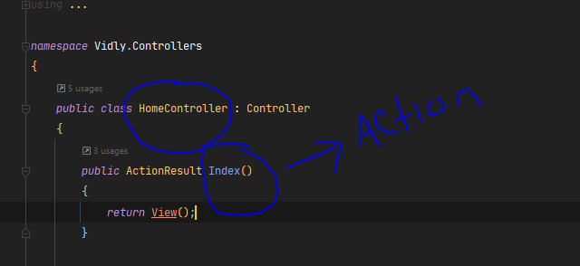
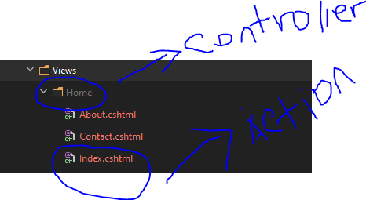

# Action Results
- is the parent of what does controller returns

```


using System.Web.Mvc;
using Vidly.Models;

namespace Vidly.Controllers
{
    public class MoviesController : Controller
    {
        // GET
        public ActionResult Random()
        {
            var movie = new Movie(){Name="Batman Begins"}; // created an object
          return View(movie); // a object of movie is passed to View this will be returned on soon to be create View folder.

        }
    }
}

```
- **return View(movie)** is a child of the **ActionResult**

## other two form of Action results return
- HttpNotFound()
- RedirectToAction()
***
##  HttpNotFound()
- just returns a page showing no result was found


```
using System.Web.Mvc;
using Vidly.Models;

namespace Vidly.Controllers
{
    public class MoviesController : Controller
    {
        // GET
        public ActionResult Random()
        {
            var movie = new Movie(){Name="Batman Begins"}; // created an object
            return HttpNotFound();
        }
    }
}


```
- 
    - result was not found
    - in the addressbar it is clearly show **http://localhost:5000/movies/random** where it shows no results. 
    - this is due to 404 results not found 
---
# RedirectToAction()    
- this will redirect page to a different site 

```
using System.Web.Mvc;
using Vidly.Models;

namespace Vidly.Controllers
{
    public class MoviesController : Controller
    {
        // GET
        public ActionResult Random()
        {
            var movie = new Movie(){Name="Batman Begins"}; // created an object 
            return RedirectToAction("Index", "Home",new {page=1,sortBy="name"});
            //index is action name 
            // Home is the controller 
            // new is the annonymous object here 
            
            
        }
    }
}


```
- 
   - this is the action from the controller class   return RedirectToAction(**"Index",** "Home",new {page=1,sortBy="name"});

- 
  - in here Home is the controlelr name from control class 
  - followed by action which is index in this case 
  -   return RedirectToAction(**"Index", "Home"**,new {page=1,sortBy="name"}); 
  - returns **Index** is the action name and **Home** is the controller name 


- 
  - thus when the page is loaded it will be redirected to here 
  - **http://localhost:5000/?page=1&sortBy=name**
  - the URL has the addressbar with the **page=1&sortBy=name** as in the return **RedirectToAction("Index", "Home",new {page=1,sortBy="name"});**  **new anonoynous object page=1 and sortBY = "name"** are passed
  
  
