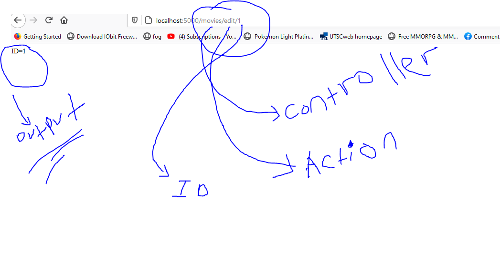
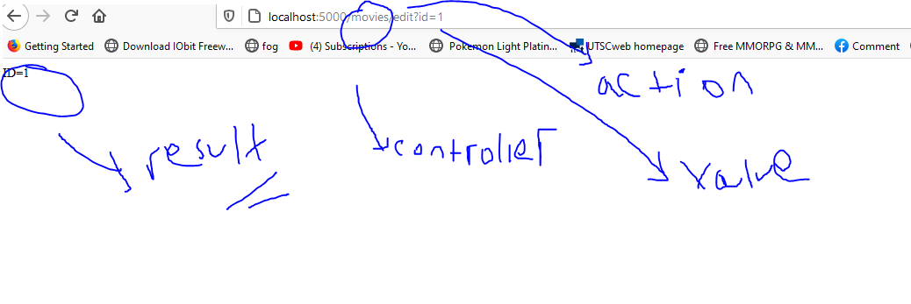
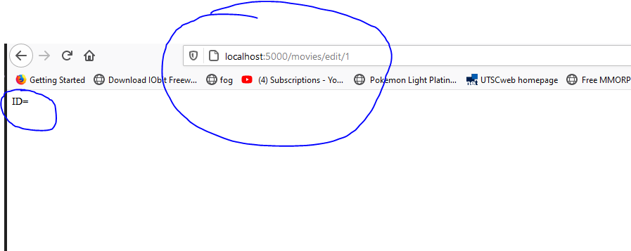
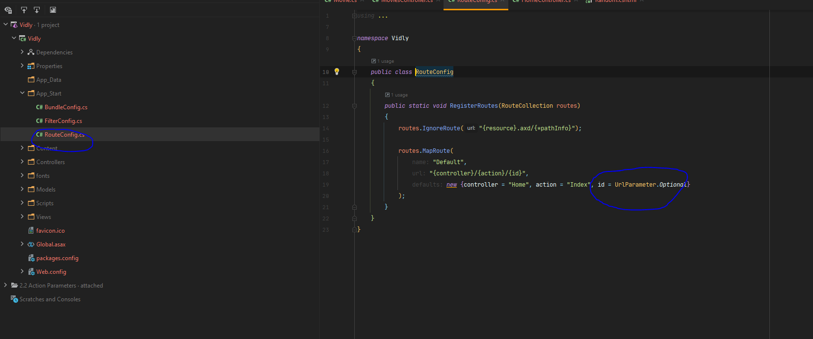
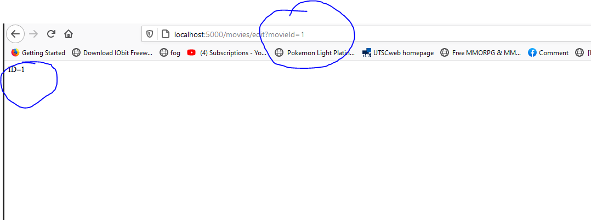
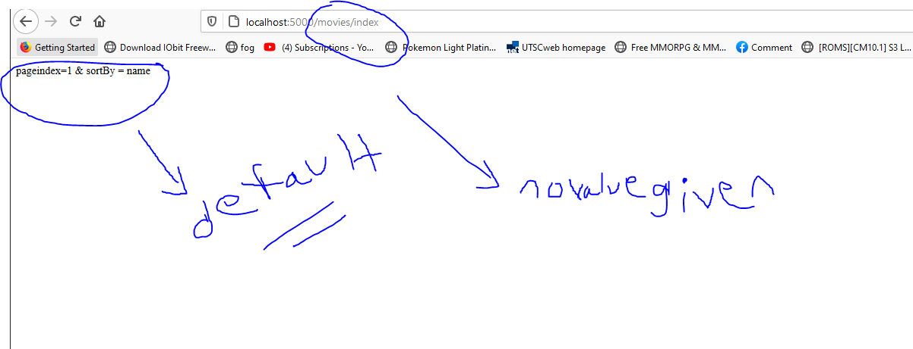
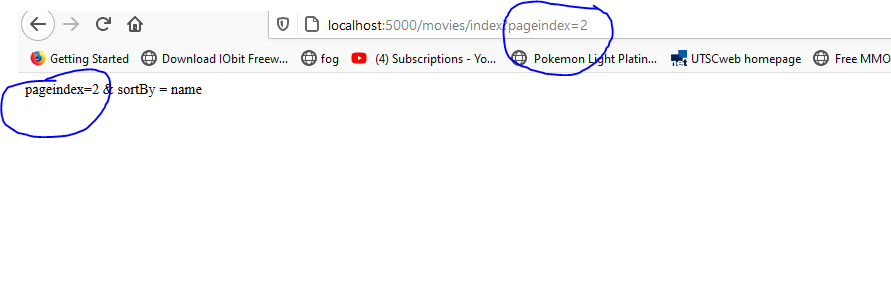
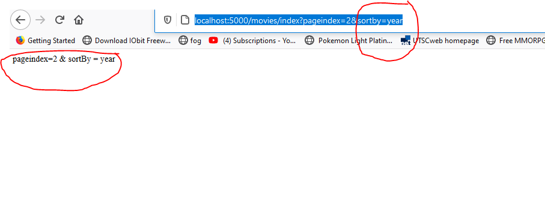

# **Action Parameters**
- input for actions

```
public ActionResult Edit(int id)
      {
          return Content($"ID={id}");
      }

```
 - in here the url will be expecting id with a value

 ### 1. when ID is passed  properly on the url
 
   - in here if the url is compared to whats in the code
     - **movies** is the Controller
     - **Edit** is the action name
     - **1** is the value that is passed
---     
 ### 1.1 other ways to pass the values
 
 - in here few things have changed
 - movies/edit?**id=1**
 - everything is same but the id is passed as with **?id=1** value


 ```
 public ActionResult Edit(int? movieID)
        {


            return Content($"ID={movieID}");

        }
 ```

  - in here the code has been updated with Id parameter changed to **movieId**
  
  - in here the **movies/edit/1** is passed but the result shows id is 0
  - this is because of the following reason
    
   - in the folder **App_start** --> **RouteConfig** has the following code


   ```
   namespace Vidly
   {
       public class RouteConfig
       {
           public static void RegisterRoutes(RouteCollection routes)
           {
               routes.IgnoreRoute("{resource}.axd/{*pathInfo}");

               routes.MapRoute(
                   name: "Default",
                   url: "{controller}/{action}/{id}",
                   defaults: new {controller = "Home", action = "Index", id = UrlParameter.Optional}
               );
           }
       }
   }

   ```
   - movieID on action is not same as id so in order for the action parameter must be named the same
   - however it can be overcomed with the following way
     
      - movies/edit?**movieId=1**
      - in here the paremeter is passed after action name followed by **?movieId=1** which is same as parameter name in the action

  ---
  # optional Parameter

  ```

  public ActionResult Index(int? pageIndex,string sortBy)
         {
             //? means nullable
             if (!pageIndex.HasValue)
             {
                 pageIndex = 1;
             }

             if (string.IsNullOrWhiteSpace(sortBy))
             {
                 sortBy = "name";
             }

             return Content($"pageindex={pageIndex} & sortBy = {sortBy}");

         }

  ```    
 - ?whenever there is a ? with nonstring value it means it can be optional
       - public ActionResult Index(**int? pageIndex**,string sortBy)

       - this is optional
```
if (!pageIndex.HasValue)
{
    pageIndex = 1;
}
```
        -  sets up a default value for pageindex  

```
if (string.IsNullOrWhiteSpace(sortBy))
          {
              sortBy = "name";
          }


```        
 - same is done for sortBy

 ----
 # default value

   - in here no value is given with parameters
   - **movies/index** value no value was here  

  - movies/index?**pageindex=2**
  - pageindex=2 & sortBy = name the outputchanged

  # passed value
  
    - movies/index?**pageindex=2&sortby=year**
    - both values are given here
